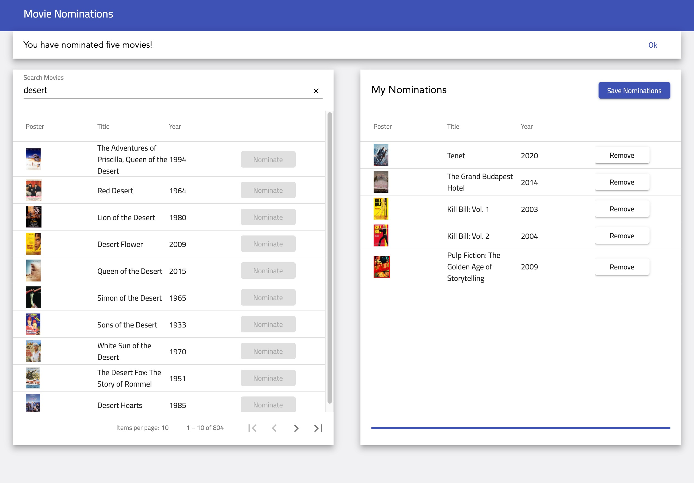

# Movie Nominations

An minimal Angular app to let users nominate their favorite movies from IMDB.

This app is deployed to GitHub pages. You can view the live demo [here](https://fangnx.github.io/movie-nominations/).

### Built With

- Angular 8.2
- [NgRx](https://ngrx.io/) - to manage state and isolate side effects
- [Angular Material](https://material.angular.io/) - to build responsive, mobile-friendly UI components
- [OMDb API](http://www.omdbapi.com/)

### Screenshot



## Getting Started

### Prerequisites

1. Get a free API key from [OMDb API](http://www.omdbapi.com/).
2. Make sure [npm](https://www.npmjs.com/get-npm) is installed on your machine.
3. Clone the repository:
   ```
   npm clone https://github.com/fangnx/movie-nominations
   ```

### Installation

```
npm install
```

### Development

```
npm start
```

## License

Distributed under the MIT License. See LICENSE for more information.
